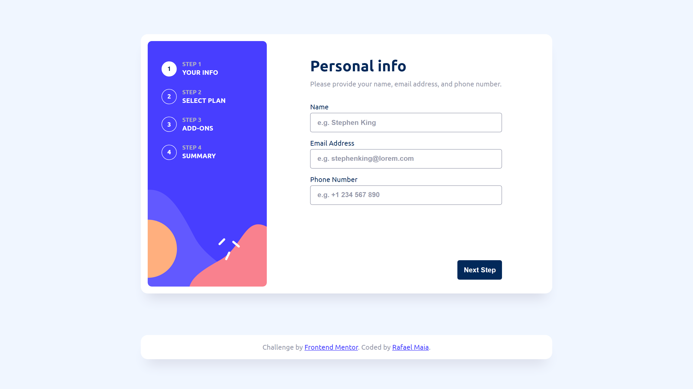

# Frontend Mentor - Multi-step form solution

This is a solution to the [Multi-step form challenge on Frontend Mentor](https://www.frontendmentor.io/challenges/multistep-form-YVAnSdqQBJ). Frontend Mentor challenges help you improve your coding skills by building realistic projects.

## Table of contents

- [Overview](#overview)
  - [The challenge](#the-challenge)
  - [Screenshot](#screenshot)
  - [Links](#links)
- [My process](#my-process)
  - [Built with](#built-with)
  - [What I learned](#what-i-learned)
  - [Continued development](#continued-development)
  - [Useful resources](#useful-resources)
- [Author](#author)

## Overview

### The challenge

Users should be able to:

- Complete each step of the sequence
- Go back to a previous step to update their selections
- See a summary of their selections on the final step and confirm their order
- View the optimal layout for the interface depending on their device's screen size
- See hover and focus states for all interactive elements on the page
- Receive form validation messages if:
  - A field has been missed
  - The email address is not formatted correctly
  - A step is submitted, but no selection has been made

### Screenshot



### Links

- Solution URL: [https://github.com/rafaeldevvv/front-end-mentor-multi-step-form](https://github.com/rafaeldevvv/front-end-mentor-multi-step-form)
- Live Site URL: [https://rafaeldevvv.github.io/front-end-mentor-multi-step-form](https://rafaeldevvv.github.io/front-end-mentor-multi-step-form)

## My process

### Built with

- Semantic HTML5 markup
- CSS
- SASS/SCSS
- Flexbox
- CSS Grid
- Mobile-first workflow
- [Webpack](https://webpack.js.org/) - Web bundler
- [React](https://reactjs.org/) - JS library
- JSX
- [TypeScript](https://www.typescriptlang.org/) - JavaScript with a type system

### What I learned

It was my first time using TypeScript and I found it quite useful. Its type system made me feel more secure about my code. The warnings were very useful most of the time and the code looks beautiful!

I created a separate file just to put the interfaces used across multiple files in:

```ts
// interfaces.js
import { Plans, ID } from "./types";

export interface IPlan {
  name: Plans;
  monthlyPrice: number;
  icon: string;
  yearlyPrice: number;
  id: ID;
}

export interface IFormData {
  name: string;
  email: string;
  phoneNumber: string;
  selectedPlanId: ID;
  isYearlyBillingEnabled: boolean;
  selectedAddonsIds: ID[];
}

export interface IAddon {
  name: string;
  desc: string;
  monthlyPrice: number;
  yearlyPrice: number;
  id: ID;
}

export interface IPriceObj {
  monthlyPrice: number;
  yearlyPrice: number;
}

export interface IInputChange {
  name: string;
  value: number | string;
}

export interface IError {
  name: string;
  message: string;
}
```

And another one for types:

```ts
// type.ts
export type Plans = "arcade" | "advanced" | "pro";
export type ID = number | string;
```

The interfaces that are just used once are in their respective files.

I kind of break the design a little bit implementing the focus ring:

```css
:focus {
  outline: var(--focus-outline);
  outline-offset: var(--focus-outline-offset);
}
```

But it is all for the sake of accessibility.

It also was my first time using @font-face:

```scss
@font-face {
  font-family: "Ubuntu";
  src: url("../assets/fonts/Ubuntu-Regular.ttf") format("truetype");
  font-weight: 400;
  font-style: normal;
}

@font-face {
  font-family: "Ubuntu";
  src: url("../assets/fonts/Ubuntu-Medium.ttf") format("truetype");
  font-weight: 500;
  font-style: normal;
}

@font-face {
  font-family: "Ubuntu";
  src: url("../assets/fonts/Ubuntu-Bold.ttf") format("truetype");
  font-weight: 700;
  font-style: normal;
}
```

### Continued development

I am going to continue learning typescript and improving my accessibility skills. I still don't know why input labels inside aria-live get read twice when the page updates or when the screen reader reads the full page from top to bottom, so I am going to focus on that in next projects.

### Useful resources

- [How to set up Typescript with Babel and Webpack](https://medium.com/@francesco.agnoletto/how-to-set-up-typescript-with-babel-and-webpack-6fba1b6e72d5) - This was very useful to me. I was having difficulty setting up an appropriate folder for my projects and it helped me a lot.
- [Stack Overflow - Should a <nav> tag be outside the <main> tag?](https://stackoverflow.com/questions/22549766/should-a-nav-tag-be-outside-the-main-tag)
- [:nth-child](https://developer.mozilla.org/en-US/docs/Web/CSS/:nth-child)
- [Naming CSS Stuff Is Really Hard](https://sparkbox.com/foundry/naming_css_stuff_is_really_hard#:~:text=A%20functional%20class%20name%20would,the%20styles%20are%20being%20applied.)
- [Switch Pattern](https://www.w3.org/WAI/ARIA/apg/patterns/switch/)
- [Switch example](https://www.w3.org/WAI/ARIA/apg/patterns/switch/examples/switch/)
- [Switch Button](https://www.w3.org/WAI/ARIA/apg/patterns/switch/examples/switch-button/)
- [Switch role](https://developer.mozilla.org/en-US/docs/Web/Accessibility/ARIA/Roles/switch_role)
- [How to build forms in React](https://www.freecodecamp.org/news/how-to-build-forms-in-react/)
- [Screen Reader issue](https://stackoverflow.com/questions/64648731/screen-reader-not-reading-the-page-when-navigated-with-keyboard-on-react-js)

## Author

- Website - [Rafael Maia](https://rafaeldevvv.github.io/portfolio)
- Frontend Mentor - [@rafaeldevvv](https://www.frontendmentor.io/profile/rafaeldevvv)
- Twitter - [@rafaeldevvv](https://www.twitter.com/rafaeldevvv)
- Instagram - [@rafaeldevvv](https://www.instagram.com/rafaeldevvv)
- Fiverr - [Rafael Maia](https://www.fiverr.com/rafael787)
- upwork - [Rafael Maia](https://www.upwork.com/freelancers/~01a4dc9692c96839dc)
